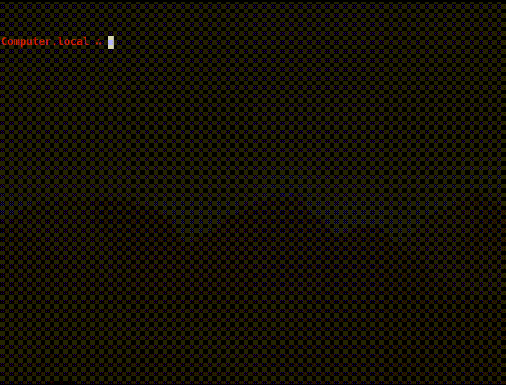

# 🌊 seaport

*A more mighty `port bump` for MacPorts!*



*⚠️ This program is very early on in development, and is still currently being built. Watch this space! ⚠️*

Effortlessly bumps version numbers and checksums for MacPorts portfiles, copies the changes to your clipboard, and optionally sends a PR to update them.

## ⬇️ Install

Note that if installing from PyPi or building from source, [MacPorts](https://www.macports.org/) needs to already be installed, and [GitHub CLI](https://cli.github.com/) is required if using the `--pr` flag.

### PyPi

```
pip install seaport
```

### Build from source

```
git clone https://github.com/harens/seaport
cd seaport
poetry install
poetry shell
seaport
```

## 💻 Usage

```txt
> seaport --help
Usage: seaport [OPTIONS] NAME

  Bumps the version number and checksum of NAME, and copies the result to
  your clipboard

Options:
  --version                 Show the version and exit.
  --bump TEXT               The new version number
  --pr PATH                 Location for where to clone the macports-ports
                            repo

  --test / --no-test        Runs port test
  --lint / --no-lint        Runs port lint --nitpick
  --install / --no-install  Installs the port and allows testing of basic
                            functionality

  --help                    Show this message and exit.
```

### 🚀 Use of sudo

Sudo is only required if `--test`, `--lint` or `--install` are specified, and it will be asked for during runtime. This is since the local portfile repo needs to be modified to be able to run the relevant commands.

Any changes made to the local portfile repo are reverted during the cleanup stage.

## 🔨 Contributing

Any change, big or small, that you think can help improve this action is more than welcome 🎉.

As well as this, feel free to open an issue with any new suggestions or bug reports. Every contribution is appreciated.

## 📒 Notice of Non-Affiliation and Disclaimer


This project is not affiliated, associated, authorized, endorsed by, or in any way officially connected with the MacPorts Project, or any of its subsidiaries or its affiliates. The official MacPorts Project website can be found at <https://www.macports.org>.

The name MacPorts as well as related names, marks, emblems and images are registered trademarks of their respective owners.
